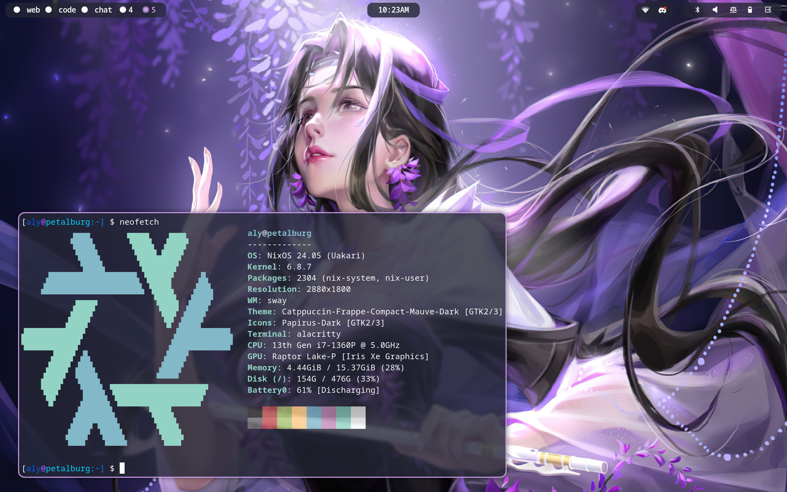

# nixcfg
NixOS flake for all of mine + my husband's hosts. Modules for Hyprland, Sway (with options for tablet optimizations), GNOME, and a variety of Home Lab services running on a mix of nix-native and OCI containers. Uses home-manager for managing dotfiles and disko for automatically partioning drives.

## Rice
### Sway

### Sway Tablet Mode


## Hosts
| Host    | lavaridge            | petalburg               | rustboro               |
|---------|----------------------|-------------------------|------------------------|
| Model   | Framework Laptop 13  | Lenovo Yoga 9i Gen 8    | ThinkPad T440p         |
| Display | 13.5" 2256x1504 60Hz | 14" 2880x1800 90hz OLED | 14" 1920x1080 60hz     |
| CPU     | AMD Ryzen 7640U      | Intel Core i7-1360P     | Intel Core i5-4210M    |
| RAM     | 32GB DDR5-5600Mhz    | 16GB LPDDR5-5200Mhz     | 16GB DDR3L-1600Mhz     |
| GPU     | AMD Radeon 760M      | Intel Iris Xe Graphics  | Intel HD Graphics 4600 |
| Storage | 1TB Sk hynix P41     | 512GB M.2 PCIe 4.0      | 512GB SATA SSD         |
| OS      | NixOS Unstable       | NixOS Unstable          | NixOS Unstable         |
| Desktop | Sway                 | Sway                    | Sway                   |

| Host    | mossdeep                | fallarbor              | mauville                |
|---------|-------------------------|------------------------|-------------------------|
| Model   | Steam Deck OLED         | Framework Laptop 13    | Custom Mini-ITX Desktop |
| Display | 7.4" 1280x800 90Hz OLED | 13.5" 2256x1504 60Hz   | 34" 3440x1440 160Hz VA  |
| CPU     | AMD "Sephiroth" APU     | Intel Core i5-1135G7   | AMD Ryzen 5 2600        |
| RAM     | 16GB LPDDR5 6400 MT/s   | 16GB DDR4-3200Mhz      | 16GB DDR4-3200Mhz       |
| GPU     | AMD RDNA 2              | Intel Iris Xe Graphics | AMD Radeon Rx 6700      |
| Storage | 512GB M.2 PCIe SSD      | 512GB M.2 PCIe 3.0     | 1TB M.2 PCIe 3.0        |
| OS      | NixOS Unstable          | NixOS Unstable         | NixOS Unstable          |
| Desktop | Hyprland                | Hyprland               | Sway                    |

## Home Lab Services
| Service          | Description                       | Source/Runtime                       | Domain                           |
|------------------|-----------------------------------|--------------------------------------|----------------------------------|
| Nix Binary Cache | LAN cache for nix derivations.    | nix-serve (nixpkgs)                  | https://nixcache.raffauflabs.com |
| Navidrome        | SubSonic-compatible music server. | nix-container (nixpkgs)              | https://music.raffauflabs.com    |
| Plex             | Music, TV, and Movie streaming.   | OCI: plexinc/pms-docker:public       | https://plex.raffauflabs.com     |
| Audiobookshelf   | Podcasts & audiobooks.            | OCI: advplyr/audiobookshelf:latest   | https://podcasts.raffauflabs.com |
| FreshRSS         | RSS & News reader.                | OCI: freshrss/freshrss:latest        | https://news.raffauflabs.com     |
| Transmission     | BitTorrent.                       | OCI: linuxserver/transmission:latest | Tailnet                          |
| Samba            | LAN file shares.                  | nixpkgs                              | Tailnet                          |
| Nginx            | Reverse proxy.                    | nixpkgs                              | Tailnet                          |
| Ollama           | Runs opensource LLMs.             | nixpkgs                              | Tailnet                          |

## Deploying to NixOS
> :red_circle: **Do not deploy this flake unmodified to your machine. It won't work.**
> This is my own [NixOS](https://nixos.org/) and [home-manager](https://github.com/nix-community/home-manager) flake for my personal devices.
> Each hardware-configuration is host-specific. If you fork this repository, replace them with the hardware-configuration.nix that NixOS generates for you.

### Enabling Flakes
While widely used and considered stable, [flakes](https://nixos.wiki/wiki/Flakes) are still considered experimental. To enable Flakes, add the following lines to your `configuration.nix` and rebuild.
```nix
nix.settings.experimental-features = [ "nix-command" "flakes" ];
```
### Building Flake
In order to deploy this Flake on your host, run the following command:
```console
sudo nixos-rebuild boot --flake github:alyraffauf/nixcfg#HOST
```
Substitute `HOST` for whichever hostname you have chosen. Reboot to apply the flake's configuration for the chosen host.

### Installing from Live USB
> :red_circle: **This will erase your computer's disk** as specified by the host configuration, installing a fresh copy of NixOS. Backup first!

If you want to install NixOS from this flake, run the following commands, substituting `HOST` with a NixOS configuration specified in `flake.nix`.
```console
sudo nix --experimental-features "nix-command flakes" run github:nix-community/disko -- --mode disko --flake github:alyraffauf/nixcfg#HOST

sudo nixos-install --no-root-password --root /mnt --flake github:alyraffauf/nixcfg#HOST
```
