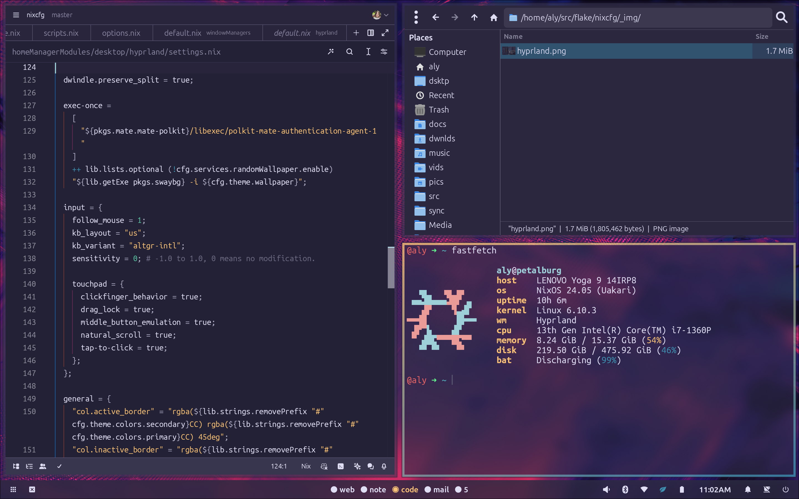

# ❄️ nixcfg

Welcome to my **nixcfg**!

This repository contains my NixOS and Home-Manager configurations, along with custom modules and packages. It is modular, declarative, and tailored for multi-device setups.

______________________________________________________________________



______________________________________________________________________

## ✨ Features

- **Encryption:** Encrypted boot drives with Secure Boot, LUKS, and TPM decryption.
- **Hardware Configuration**: Robust hardware support for all hosts.
- **Home-Manager**: Unified management of user environments.
- **Hyprland:** Dynamic tiling Wayland compositor and window manager.
- **Modular Configuration**: Organized and reusable modules for simplicity.
- **Multi-Device Support**: Written with multiple hosts in mind.
- **Stylix:** Auto-generated base16 themes for the whole desktop.

______________________________________________________________________

## 📂 Repository Structure

```plaintext
.
├── flake.nix          # Main entry point
├── home/              # home-manager configurations
├── hosts/             # NixOS host configurations
├── modules/           # Modules for NixOS and home-manager
├── overlays/          # Custom Nixpkgs overlays
├── pkgs/              # Custom packages
├── secrets/           # Encrypted secrets
└── README.md          # This README
```

### Key Files and Directories

- **`flake.nix`**: Central file linking all configurations using Nix Flakes.
- **`home/`**: User-specific home-manager configurations.
- **`hosts/`**: Host configurations for NixOS.
- **`modules/`**: Modules for NixOS and home-manager.
- **`overlays/`**: Defines custom overlays to extend or override Nixpkgs.
- **`pkgs/`**: Houses custom or patched package definitions.
- **`secrets/`**: Securely stores encrypted credentials or sensitive data.

______________________________________________________________________

## 🚀 Getting Started

### Prerequisites

- A working Nix installation with Flakes enabled.
- Familiarity with NixOS, Home-Manager, and declarative configurations.

### Clone the Repository

```bash
git clone https://github.com/alyraffauf/nixcfg.git
cd nixcfg
```

### Apply the Configuration

For **NixOS** systems:

```bash
sudo nixos-rebuild switch --flake .#<hostname>
```

For **Home-Manager** setups:

```bash
home-manager switch --flake .
```

> Replace `<hostname>` with the desired system configuration from your modules.

______________________________________________________________________

## 🤝 Contributing

While this is a personal project, I’m open to feedback or suggestions.\
Feel free to open an issue or share ideas that could improve this setup!

______________________________________________________________________

## 📜 License

This repository is licensed under the **[GNU General Public License](LICENSE.md)**.

______________________________________________________________________

## 🙌 Acknowledgments

- [nixpkgs](github.com/nixos/nixpkgs): 'nough said.
- [agenix](https://github.com/ryantm/agenix): secrets storage and orchestration.
- [disko](https://github.com/nix-community/disko): declarative partitions and disk configuration.
- [home-manager](https://github.com/nix-community/home-manager): declarative dotfile and user package management.
- [hyprland](https://github.com/hyprwm/Hyprland): great dynamic tiling wayland compositor.
- [lanzaboote](https://github.com/nix-community/lanzaboote): secure boot for NixOS.
- [nur](https://github.com/nix-community/NUR): extra packages from the nix user repository.
- [stylix](https://github.com/danth/stylix): system-wide color schemes and typography.

______________________________________________________________________

## ⭐ Stargazers Over Time

[](https://starchart.cc/alyraffauf/nixcfg)

______________________________________________________________________
