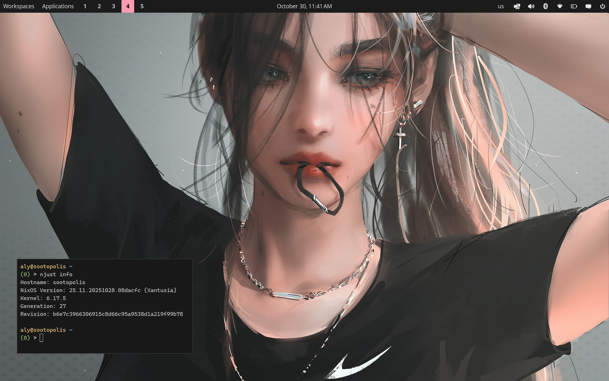

# ❄️ nixcfg

Welcome to my **nixcfg**!

This repository contains my Darwin, NixOS and home-manager configurations, along with whatever custom modules and packages they require. Hopefully, it's as useful to you as it is to me!

---



---

## ✨ Features

- **Declarative System & Dotfiles:** Fully declarative management of my macOS (Darwin) + Linux installations and user environments (dotfiles, packages) using Flakes, NixOS, nix-darwin, and home-manager.
- **Secure Boot & Encryption:** Encrypted boot drives with Secure Boot via `lanzaboote` and automatic LUKS decryption using TPM.
- **Comprehensive Hardware Support:** Meticulously crafted configurations for my (sometimes unique) devices, including custom audio enhancements (Pipewire filter chains) and device-specific power optimizations.
- **Robust Networking:** Secure and flexible networking with Tailscale (it's WireGuard), declarative WiFi profiles, and NFS/Samba shares.
- **Productivity & Development:** Pre-configured tools for development (Git, Helix, VS Code, Zed), shell enhancements (fastfetch, oh-my-posh, zsh), etc.

---

## 🔗 Related Flakes

- [cute.haus](https://github.com/alyraffauf/cute.haus): Homelab cluster previously located in this repository.
- [flake](https://github.com/alyraffauf/flake): Fully featured flake template for NixOS, nix-darwin, home-manager configurations, and software projects.
- [fontix](https://github.com/alyraffauf/fontix): Home-manager modules for setting consistent fonts and sizing across applications.
- [safari](https://github.com/alyraffauf/safari): Shell configuration, also previously in this repository.
- [secrets](https://github.com/alyraffauf/secrets): Encrypted secrets storage using agenix.
- [snippets](https://github.com/alyraffauf/snippets): Reusable Nix snippets used across multiple repositories.

---

## 📂 Repository Structure

```plaintext
.
├── flake.nix                # Main entry point
├── homes/                   # home-manager configurations
├── hosts/                   # NixOS and Darwin host configurations
├── modules/                 # Modular configurations
│   ├── darwin/              # macOS-specific modules
│   ├── home/                # home-manager modules
│   ├── flake/               # Organized flake components
│   │   ├── darwin.nix       # macOS-specific configurations
│   │   ├── home-manager.nix # Home-manager configurations
│   │   ├── nixos.nix        # NixOS-specific configurations
│   │   └── ...              # Other flake components
│   ├── nixos/               # NixOS-specific modules
│   └── snippets/            # Reusable configuration snippets
└── overlays/                # Custom Nixpkgs overlays
```

---

## 🤝 Contributing

While this is a personal project, I’m open to feedback or suggestions.\
Feel free to open an issue or share ideas that could improve this setup!

---

## 📜 License

This repository is licensed under the **[GNU General Public License](LICENSE.md)**.

---

## ⭐ Stargazers Over Time

[](https://starchart.cc/alyraffauf/nixcfg)

---
